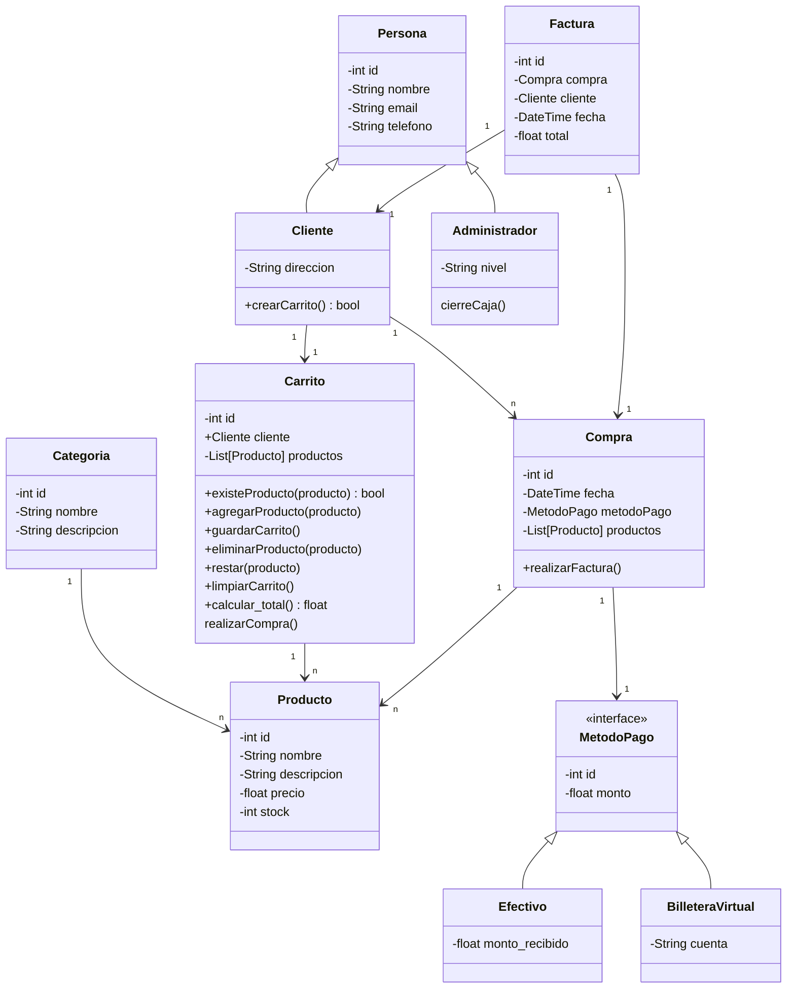
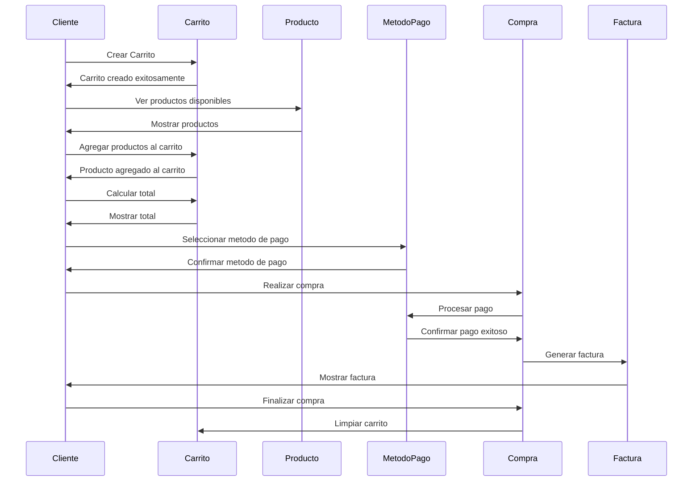
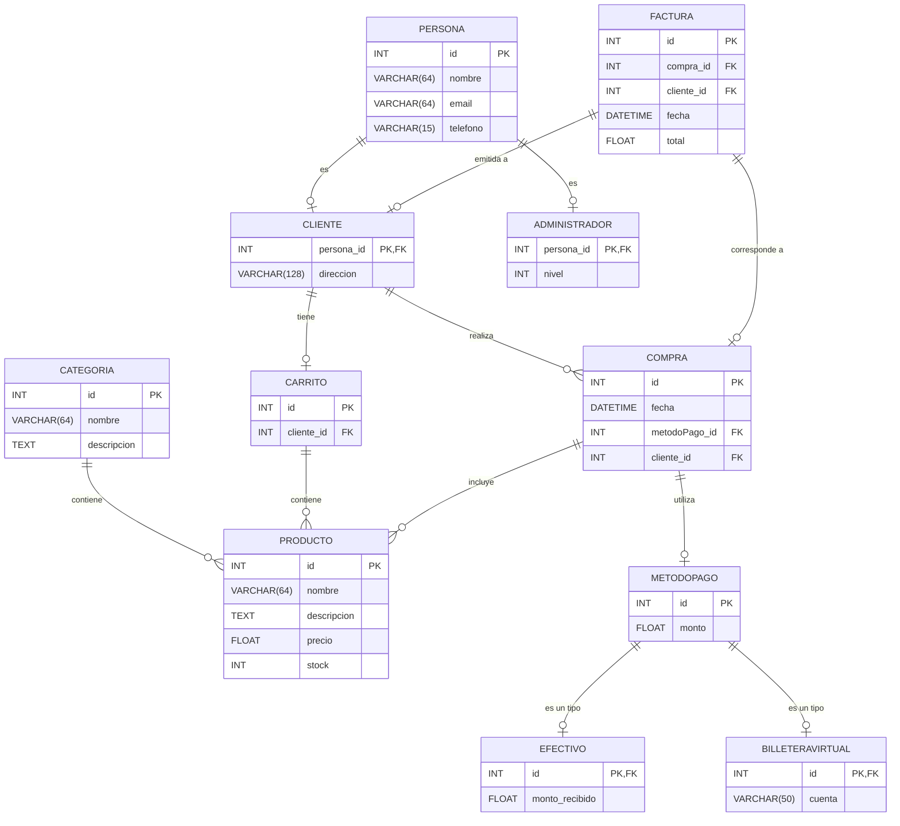

# Proyecto: Carrito de Compras en Django


## Descripción del Proyecto

Este proyecto consiste en el desarrollo de un sistema de carrito de compras en línea, diseñado para facilitar la inscripción a cursos a través de una interfaz web moderna y funcional.  
Implementado en **Python** con el framework **Django**, el sistema incorpora características esenciales como:

- Navegación de productos.
- Gestión de carrito.
- Confirmación de pedidos.

El sistema integra principios de **programación orientada a objetos** tales como **herencia**, **polimorfismo** y **encapsulamiento**, así como el uso de **patrones de diseño**.  
El enfoque principal está en ofrecer una experiencia de usuario fluida y eficiente mediante una interfaz ideal tanto para usuarios de escritorio como para dispositivos móviles. Además, incluye funcionalidades administrativas que permiten gestionar el inventario de manera simple y eficaz.

---

## Contexto y Propósito del Proyecto

Este proyecto busca atender la necesidad de pequeños y medianos negocios de contar con una herramienta accesible para vender sus cursos de manera digital.  
El propósito principal es:

- Crear una base tecnológica sólida que pueda ampliarse en el futuro para incluir:
  - Integraciones como sistemas de envío.
  - Pasarelas de pago.
  - Análisis avanzados de datos.

Además, este proyecto representa una oportunidad para que el equipo adquiera experiencia práctica en desarrollo web, diseño orientado a objetos y trabajo colaborativo.

---

## Equipo del Proyecto

- **Juan Carbajal**  
- **Santiago Falcón**  
- **Iván Popiel**  
- **Nahuel Ramallo**


## JIRA del proyecto
[JIRA del proyecto](https://ezequiel-grisoski.atlassian.net/jira/software/projects/CAC/boards/3)

## Objetivo del Proyecto

Crear un sistema de carrito de compras funcional implementado en Python con el framework Django, para su navegación web. Este sistema busca proporcionar a los usuarios una experiencia de compra fluida, desde la navegación de productos hasta la confirmación de pedidos. 

El sistema permitirá a los usuarios explorar productos, agregar ítems al carrito y realizar compras. Los administradores podrán gestionar el inventario de productos y modificar la base de datos.

El proyecto también está diseñado para ser escalable, facilitando la integración futura con pasarelas de pago, funciones de pago, recomendaciones de productos o historial de compras.

---

## Alcance

### Para usuarios:
1. Navegar listado de productos.
2. Visualizar detalles de los productos, incluyendo descripción, precio y disponibilidad.
3. Crear y gestionar un carrito de compras con opciones para agregar o quitar productos.
4. Confirmar compras y recibir detalles de los productos seleccionados y el total.

### Para administradores:
1. Gestionar el inventario: alta, baja y actualización de productos.
2. Monitorear los pedidos confirmados y asegurar la disponibilidad del stock.
3. Acceder a una interfaz simplificada para realizar modificaciones rápidas en el sistema.

---

## Límites del Sistema

### Incluido:
1. **Gestión de productos:** Alta, baja, modificación y consulta de productos disponibles en la base de datos.
2. **Carrito de compras:** Funciones de agregar, eliminar productos y calcular totales en tiempo real.
3. **Interfaz de usuario:** Página web que garantiza simplicidad y rapidez en las operaciones.
4. **Seguridad básica:** Validación de formularios.

### Excluido:
1. Gestión de envíos: no incluye seguimiento ni cálculo de costos de envío.
2. Integración con múltiples pasarelas de pago: los pagos son simulados.
3. Reportes avanzados: estadísticas de ventas o reportes de inventario.
4. Multilenguaje: solo estará disponible en español en la versión inicial.

---

## Requerimientos Funcionales

### Navegación de Productos:
- Visualización de una lista de productos disponibles.
- Mostrar el stock disponible de cada producto.

### Carrito de Compras:
- Permitir agregar productos al carrito.
- Mostrar un resumen actualizado del carrito con precios, cantidades y total.
- Opción para eliminar productos del carrito o vaciarlo completamente.

### Gestión de Pedidos:
- Confirmar pedidos desde el carrito.
- Actualizar el stock automáticamente al confirmar un pedido.
- Registrar fecha y hora de los pedidos confirmados.

### Gestión de Productos (Administrador):
- Agregar, modificar y eliminar productos del catálogo.
- Editar la cantidad de stock.
- Visualizar claramente los productos sin stock.

---

## Requerimientos No Funcionales

1. **Usabilidad:** Interfaz clara e intuitiva.
2. **Rendimiento:** Operaciones como agregar productos o confirmar pedidos deben procesarse en menos de 3 segundos.
3. **Escalabilidad:** Compatible con futuras integraciones como pasarelas de pago o sistemas de trackeo.
4. **Compatibilidad:** Funcionamiento en navegadores modernos y dispositivos móviles.
5. **Mantenibilidad:** Código modular y documentado para facilitar el mantenimiento y expansión.

---

# Historias de Usuario

## Usuario

### I. Ver productos
Como **usuario**,  
quiero **ver una lista de todos los productos de la tienda**,  
para **elegir los productos que quiero comprar**.

### II. Visualizar carrito
Como **usuario**,  
quiero **tener acceso al carrito**,  
para **tener un control de los productos en los que estoy interesado**.

### III. Visualizar stock
Como **usuario**,  
quiero **visualizar el stock en tiempo real**,  
para **saber la cantidad de unidades disponibles que el sistema posee**.

### IV. Agregar productos al carrito
Como **usuario**,  
quiero **poder agregar productos al carrito**,  
para **tener una lista de los productos que he seleccionado**.

### V. Eliminar productos del carrito
Como **usuario**,  
quiero **poder eliminar un producto especificado**,  
para **regular mi selección antes de finalizar la compra**.

### VI. Sumar productos desde el carrito
Como **usuario**,  
quiero **poder aumentar un producto desde el carrito**,  
para **ajustar las cantidades en base a mis intereses**.

### VII. Restar productos del carrito
Como **usuario**,  
quiero **reducir la cantidad de productos en mi carrito**,  
para **ajustar las cantidades en base a mi presupuesto o necesidades**.

### VIII. Vaciar el carrito
Como **usuario**,  
quiero **poder vaciar el carrito solo con un click**,  
para **borrar todos los productos y así poder empezar de nuevo**.

### IX. Comprar productos
Como **usuario**,  
quiero **poder comprar los productos seleccionados en el carrito**,  
para **finalizar mi compra de manera rápida y segura**.

---

## Administrador

### I. Administrar productos
Como **administrador**,  
quiero **poder gestionar la lista de productos en la tienda**,  
para **mantener actualizada la oferta de productos disponibles para los usuarios**.

### II. Agregar productos a la Base de datos
Como **administrador**,  
quiero **poder añadir nuevos productos a la base de datos**,  
para **ampliar el catálogo y ofrecer más opciones**.

### III. Eliminar productos de la Base de datos
Como **administrador**,  
quiero **poder eliminar productos de la base de datos**,  
para **asegurar que solo los productos disponibles se puedan visualizar**.

### IV. Actualizar los productos
Como **administrador**,  
quiero **actualizar los productos**,  
para **que la cantidad disponible refleje un stock real y evitar así errores en las compras**.

---

## Stack Tecnológico

- **Lenguaje de programación:** Python.
- **Framework de desarrollo web:** Django.
- **Base de datos:** SQLite.
- **Frontend:** HTML5, CSS3.
- **Control de versiones:** Git y GitHub.

---


## Estructura del Proyecto

- **migrations/**  
- **static/**  
  - Contiene CSS, imágenes y JavaScript.  
- **templates/**  
  - Contiene `carritoVista.html` e `index.html`.  
- **carrito.py**  
- **admin.py**  
- **apps.py**  
- **context_processor.py**  
- **models.py**  
- **tests.py**  
- **views.py**  


## Diagrama de Clases



---


## Diagrama de Secuencia




---


## Pruebas Unitarias
```python
import unittest
from carrito import Carrito
from producto import Producto
from compra import Compra
from metodo_pago import MetodoPago

class TestCarrito(unittest.TestCase):
    
    def setUp(self):
        # Crear productos de prueba
        self.producto1 = Producto(id=1, nombre="Producto A", descripcion="Descripción A", precio=100.0, stock=10)
        self.producto2 = Producto(id=2, nombre="Producto B", descripcion="Descripción B", precio=200.0, stock=5)
        
        # Crear un carrito de prueba
        self.carrito = Carrito(cliente_id=1)
    
    def test_agregar_producto(self):
        """Probar que agregar un producto al carrito funciona correctamente"""
        self.carrito.agregar_producto(self.producto1)
        self.assertIn(self.producto1, self.carrito.productos)
    
    def test_calcular_total(self):
        """Probar que el cálculo del total del carrito funciona correctamente"""
        self.carrito.agregar_producto(self.producto1)
        self.carrito.agregar_producto(self.producto2)
        total = self.carrito.calcular_total()
        self.assertEqual(total, 300.0)
    
    def test_eliminar_producto(self):
        """Probar que se puede eliminar un producto del carrito"""
        self.carrito.agregar_producto(self.producto1)
        self.carrito.eliminar_producto(self.producto1)
        self.assertNotIn(self.producto1, self.carrito.productos)
    
    def test_realizar_compra(self):
        """Probar que se puede realizar una compra correctamente"""
        self.carrito.agregar_producto(self.producto1)
        metodo_pago = MetodoPago(id=1, monto=100.0)
        compra = Compra(cliente_id=1, metodo_pago=metodo_pago, productos=[self.producto1])
        
        # Simulamos la compra
        resultado_compra = compra.realizar_compra()
        self.assertTrue(resultado_compra)
    
    def test_limpiar_carrito(self):
        """Probar que se puede limpiar el carrito correctamente"""
        self.carrito.agregar_producto(self.producto1)
        self.carrito.limpiar_carrito()
        self.assertEqual(len(self.carrito.productos), 0)

if __name__ == '__main__':
    unittest.main()
```
## Diagrama Entidad-Relación (DER)



---


## Diccionario de Datos

### Tabla: `PRODUCTO`
Esta tabla almacena información sobre los productos disponibles en la tienda, incluyendo el nombre, descripción, precio y cantidad en stock.

| Campo        | Tipo de Dato   | Descripción                                                    |
|--------------|----------------|----------------------------------------------------------------|
| `id`         | INT            | Identificador único del producto (clave primaria).             |
| `nombre`     | VARCHAR(64)    | Nombre del producto.                                           |
| `descripcion`| TEXT           | Descripción detallada del producto.                            |
| `precio`     | FLOAT          | Precio del producto.                                           |
| `stock`      | INT            | Cantidad disponible en stock del producto.                     |

---

### Tabla: `CATEGORIA`
Esta tabla almacena las categorías de productos, proporcionando una clasificación para cada producto.

| Campo        | Tipo de Dato   | Descripción                                                    |
|--------------|----------------|----------------------------------------------------------------|
| `id`         | INT            | Identificador único de la categoría (clave primaria).          |
| `nombre`     | VARCHAR(64)    | Nombre de la categoría.                                        |
| `descripcion`| TEXT           | Descripción de la categoría.                                   |

---

### Tabla: `PERSONA`
Esta tabla contiene información básica sobre las personas, incluyendo su nombre, correo electrónico y número de teléfono.

| Campo        | Tipo de Dato   | Descripción                                                    |
|--------------|----------------|----------------------------------------------------------------|
| `id`         | INT            | Identificador único de la persona (clave primaria).            |
| `nombre`     | VARCHAR(64)    | Nombre de la persona.                                          |
| `email`      | VARCHAR(64)    | Correo electrónico de la persona.                              |
| `telefono`   | VARCHAR(15)    | Número de teléfono de la persona.                              |

---

### Tabla: `CLIENTE`
Esta tabla almacena información específica de los clientes, que heredan de la tabla `PERSONA`.

| Campo        | Tipo de Dato   | Descripción                                                    |
|--------------|----------------|----------------------------------------------------------------|
| `persona_id` | INT            | Identificador de la persona (clave primaria y foránea a `PERSONA`). |
| `direccion`  | VARCHAR(128)   | Dirección del cliente.                                         |

---

### Tabla: `ADMINISTRADOR`
Esta tabla almacena información específica de los administradores, que heredan de la tabla `PERSONA`.

| Campo        | Tipo de Dato   | Descripción                                                    |
|--------------|----------------|----------------------------------------------------------------|
| `persona_id` | INT            | Identificador de la persona (clave primaria y foránea a `PERSONA`). |
| `nivel`      | INT            | Nivel del administrador                                             |

---

### Tabla: `CARRITO`
Esta tabla contiene información sobre los carritos de compra de los clientes.

| Campo        | Tipo de Dato   | Descripción                                                    |
|--------------|----------------|----------------------------------------------------------------|
| `id`         | INT            | Identificador único del carrito (clave primaria).              |
| `cliente_id` | INT            | Identificador del cliente (foránea a `CLIENTE`).               |

---

### Tabla: `COMPRA`
Esta tabla almacena los detalles de cada compra realizada por los clientes, incluyendo el método de pago y el cliente asociado.

| Campo         | Tipo de Dato   | Descripción                                                   |
|---------------|----------------|---------------------------------------------------------------|
| `id`          | INT            | Identificador único de la compra (clave primaria).            |
| `fecha`       | DATETIME       | Fecha en que se realizó la compra.                            |
| `metodoPago_id` | INT         | Identificador del método de pago utilizado (foránea a `METODOPAGO`). |
| `cliente_id`  | INT            | Identificador del cliente que realizó la compra (foránea a `CLIENTE`). |

---

### Tabla: `METODOPAGO`
Esta tabla abstracta define la estructura general de un método de pago.

| Campo        | Tipo de Dato   | Descripción                                                    |
|--------------|----------------|----------------------------------------------------------------|
| `id`         | INT            | Identificador único del método de pago (clave primaria).       |
| `monto`      | FLOAT          | Monto pagado.                                                  |

---

### Tabla: `EFECTIVO`
Esta tabla específica almacena información de pagos realizados en efectivo.

| Campo            | Tipo de Dato   | Descripción                                                    |
|------------------|----------------|----------------------------------------------------------------|
| `id`             | INT            | Identificador único (clave primaria y foránea a `METODOPAGO`). |
| `monto_recibido` | FLOAT          | Monto recibido en efectivo.                                    |

---

### Tabla: `BILLETERAVIRTUAL`
Esta tabla específica almacena información de pagos realizados mediante billetera virtual.

| Campo     | Tipo de Dato   | Descripción                                                    |
|-----------|----------------|----------------------------------------------------------------|
| `id`      | INT            | Identificador único (clave primaria y foránea a `METODOPAGO`). |
| `cuenta`  | VARCHAR(50)    | Cuenta de la billetera virtual.                                |

---

### Tabla: `FACTURA`
Esta tabla almacena la información de cada factura generada para las compras.

| Campo        | Tipo de Dato   | Descripción                                                    |
|--------------|----------------|----------------------------------------------------------------|
| `id`         | INT            | Identificador único de la factura (clave primaria).            |
| `compra_id`  | INT            | Identificador de la compra asociada (foránea a `COMPRA`).      |
| `cliente_id` | INT            | Identificador del cliente (foránea a `CLIENTE`).               |
| `fecha`      | DATETIME       | Fecha de emisión de la factura.                                |
| `total`      | FLOAT          | Total de la factura.                                           |