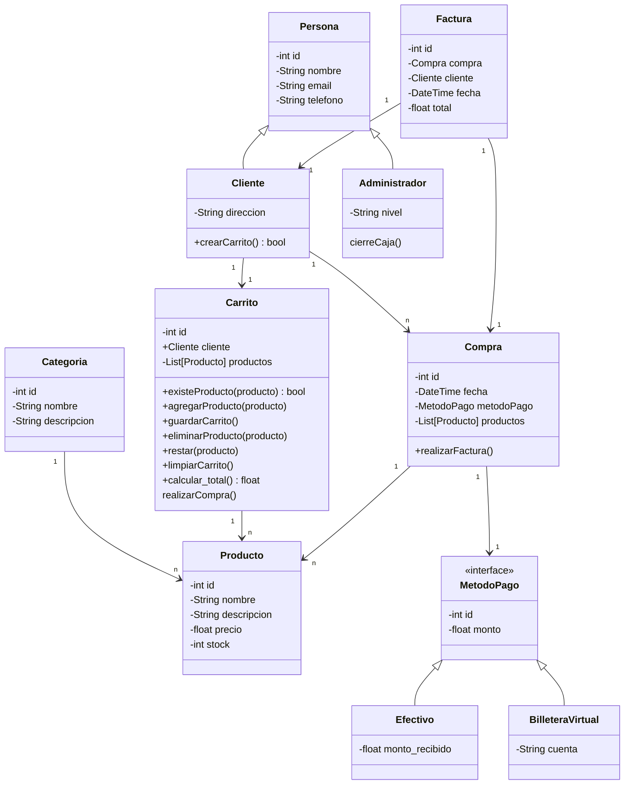
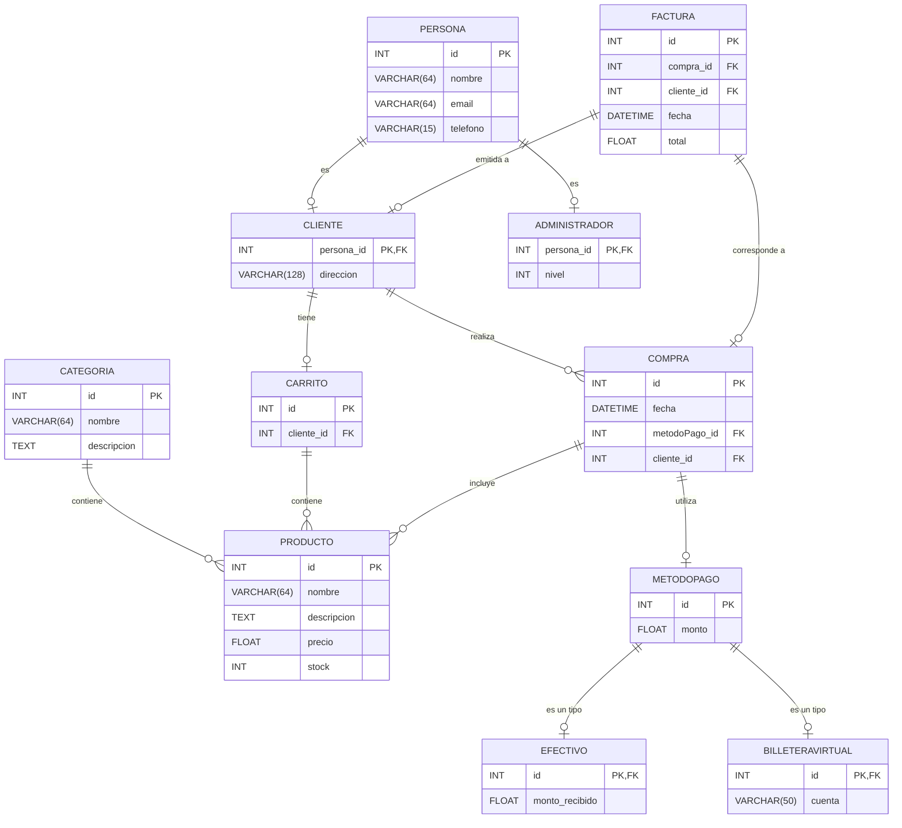

# Proyecto Carrito de Compras

## JIRA del proyecto
[JIRA del proyecto](https://ezequiel-grisoski.atlassian.net/jira/software/projects/CAC/boards/3)

## Diagrama de Clases

## Diagrama Entidad-Relación (DER)

## Diccionario de Datos

### Tabla: `PRODUCTO`
Esta tabla almacena información sobre los productos disponibles en la tienda, incluyendo el nombre, descripción, precio y cantidad en stock.

| Campo        | Tipo de Dato   | Descripción                                                    |
|--------------|----------------|----------------------------------------------------------------|
| `id`         | INT            | Identificador único del producto (clave primaria).             |
| `nombre`     | VARCHAR(64)    | Nombre del producto.                                           |
| `descripcion`| TEXT           | Descripción detallada del producto.                            |
| `precio`     | FLOAT          | Precio del producto.                                           |
| `stock`      | INT            | Cantidad disponible en stock del producto.                     |

---

### Tabla: `CATEGORIA`
Esta tabla almacena las categorías de productos, proporcionando una clasificación para cada producto.

| Campo        | Tipo de Dato   | Descripción                                                    |
|--------------|----------------|----------------------------------------------------------------|
| `id`         | INT            | Identificador único de la categoría (clave primaria).          |
| `nombre`     | VARCHAR(64)    | Nombre de la categoría.                                        |
| `descripcion`| TEXT           | Descripción de la categoría.                                   |

---

### Tabla: `PERSONA`
Esta tabla contiene información básica sobre las personas, incluyendo su nombre, correo electrónico y número de teléfono.

| Campo        | Tipo de Dato   | Descripción                                                    |
|--------------|----------------|----------------------------------------------------------------|
| `id`         | INT            | Identificador único de la persona (clave primaria).            |
| `nombre`     | VARCHAR(64)    | Nombre de la persona.                                          |
| `email`      | VARCHAR(64)    | Correo electrónico de la persona.                              |
| `telefono`   | VARCHAR(15)    | Número de teléfono de la persona.                              |

---

### Tabla: `CLIENTE`
Esta tabla almacena información específica de los clientes, que heredan de la tabla `PERSONA`.

| Campo        | Tipo de Dato   | Descripción                                                    |
|--------------|----------------|----------------------------------------------------------------|
| `persona_id` | INT            | Identificador de la persona (clave primaria y foránea a `PERSONA`). |
| `direccion`  | VARCHAR(128)   | Dirección del cliente.                                         |

---

### Tabla: `ADMINISTRADOR`
Esta tabla almacena información específica de los administradores, que heredan de la tabla `PERSONA`.

| Campo        | Tipo de Dato   | Descripción                                                    |
|--------------|----------------|----------------------------------------------------------------|
| `persona_id` | INT            | Identificador de la persona (clave primaria y foránea a `PERSONA`). |
| `nivel`      | INT            | Nivel del administrador                                             |

---

### Tabla: `CARRITO`
Esta tabla contiene información sobre los carritos de compra de los clientes.

| Campo        | Tipo de Dato   | Descripción                                                    |
|--------------|----------------|----------------------------------------------------------------|
| `id`         | INT            | Identificador único del carrito (clave primaria).              |
| `cliente_id` | INT            | Identificador del cliente (foránea a `CLIENTE`).               |

---

### Tabla: `COMPRA`
Esta tabla almacena los detalles de cada compra realizada por los clientes, incluyendo el método de pago y el cliente asociado.

| Campo         | Tipo de Dato   | Descripción                                                   |
|---------------|----------------|---------------------------------------------------------------|
| `id`          | INT            | Identificador único de la compra (clave primaria).            |
| `fecha`       | DATETIME       | Fecha en que se realizó la compra.                            |
| `metodoPago_id` | INT         | Identificador del método de pago utilizado (foránea a `METODOPAGO`). |
| `cliente_id`  | INT            | Identificador del cliente que realizó la compra (foránea a `CLIENTE`). |

---

### Tabla: `METODOPAGO`
Esta tabla abstracta define la estructura general de un método de pago.

| Campo        | Tipo de Dato   | Descripción                                                    |
|--------------|----------------|----------------------------------------------------------------|
| `id`         | INT            | Identificador único del método de pago (clave primaria).       |
| `monto`      | FLOAT          | Monto pagado.                                                  |

---

### Tabla: `EFECTIVO`
Esta tabla específica almacena información de pagos realizados en efectivo.

| Campo            | Tipo de Dato   | Descripción                                                    |
|------------------|----------------|----------------------------------------------------------------|
| `id`             | INT            | Identificador único (clave primaria y foránea a `METODOPAGO`). |
| `monto_recibido` | FLOAT          | Monto recibido en efectivo.                                    |

---

### Tabla: `BILLETERAVIRTUAL`
Esta tabla específica almacena información de pagos realizados mediante billetera virtual.

| Campo     | Tipo de Dato   | Descripción                                                    |
|-----------|----------------|----------------------------------------------------------------|
| `id`      | INT            | Identificador único (clave primaria y foránea a `METODOPAGO`). |
| `cuenta`  | VARCHAR(50)    | Cuenta de la billetera virtual.                                |

---

### Tabla: `FACTURA`
Esta tabla almacena la información de cada factura generada para las compras.

| Campo        | Tipo de Dato   | Descripción                                                    |
|--------------|----------------|----------------------------------------------------------------|
| `id`         | INT            | Identificador único de la factura (clave primaria).            |
| `compra_id`  | INT            | Identificador de la compra asociada (foránea a `COMPRA`).      |
| `cliente_id` | INT            | Identificador del cliente (foránea a `CLIENTE`).               |
| `fecha`      | DATETIME       | Fecha de emisión de la factura.                                |
| `total`      | FLOAT          | Total de la factura.                                           |

