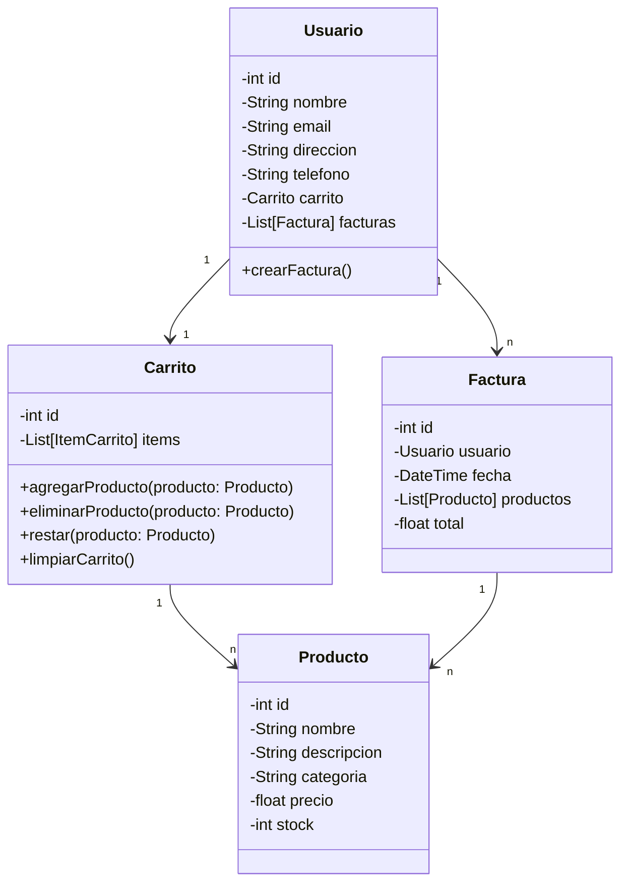

# Proyecto Carrito de Compras

## JIRA del proyecto
[JIRA del proyecto](https://ezequiel-grisoski.atlassian.net/jira/software/projects/CAC/boards/3)

## Diagrama de Clases

## Diagrama Entidad-Relación (DER)

## Diccionario de Datos

### Tabla: `PRODUCTO`

Esta tabla almacena información sobre los productos disponibles en la tienda, incluyendo el nombre, descripción, categoría, precio y stock.

| Campo        | Tipo de Dato   | Descripción                                                    |
|--------------|----------------|----------------------------------------------------------------|
| `id`         | int            | Identificador único del producto (clave primaria).             |
| `nombre`     | VARCHAR(50)     | Nombre del producto.                                           |
| `descripcion`| TEXT           | Descripción detallada del producto.                            |
| `categoria`  | VARCHAR(40)     | Categoría a la que pertenece el producto.                      |
| `precio`     | FLOAT          | Precio del producto.                                           |
| `stock`      | int            | Cantidad disponible en stock del producto.                     |
