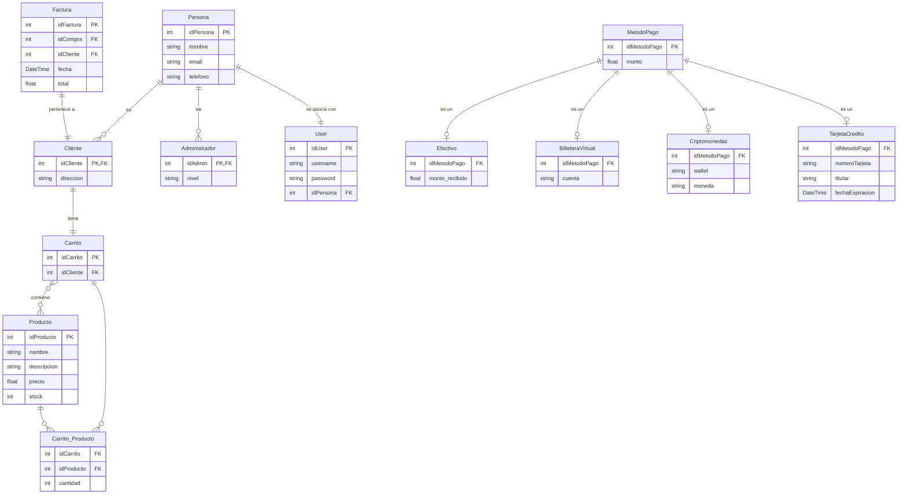

# Proyecto: Carrito de Compras en Django


## Descripción del Proyecto

Este proyecto consiste en el desarrollo de un sistema de carrito de compras en línea, diseñado para facilitar la inscripción a cursos a través de una interfaz web moderna y funcional.  
Implementado en **Python** con el framework **Django**, el sistema incorpora características esenciales como:

- Navegación de productos.
- Gestión de carrito.
- Confirmación de pedidos.

El sistema integra principios de **programación orientada a objetos** tales como **herencia**, **polimorfismo** y **encapsulamiento**, así como el uso de **patrones de diseño**.  
El enfoque principal está en ofrecer una experiencia de usuario fluida y eficiente mediante una interfaz ideal tanto para usuarios de escritorio como para dispositivos móviles. Además, incluye funcionalidades administrativas que permiten gestionar el inventario de manera simple y eficaz.

---

## Contexto y Propósito del Proyecto

Este proyecto busca atender la necesidad de pequeños y medianos negocios de contar con una herramienta accesible para vender sus cursos de manera digital.  
El propósito principal es:

- Crear una base tecnológica sólida que pueda ampliarse en el futuro para incluir:
  - Integraciones como sistemas de envío.
  - Pasarelas de pago.
  - Análisis avanzados de datos.

Además, este proyecto representa una oportunidad para que el equipo adquiera experiencia práctica en desarrollo web, diseño orientado a objetos y trabajo colaborativo.

---

## Equipo del Proyecto

- **Juan Carbajal**  
- **Santiago Falcón**  
- **Iván Popiel**  
- **Nahuel Ramallo**

--- 

## JIRA del proyecto

[JIRA del proyecto](https://ezequiel-grisoski.atlassian.net/jira/software/projects/CAC/boards/3)

---

## Objetivo del Proyecto

Crear un sistema de carrito de compras funcional implementado en Python con el framework Django, para su navegación web. Este sistema busca proporcionar a los usuarios una experiencia de compra fluida, desde la navegación de productos hasta la confirmación de pedidos. 

El sistema permitirá a los usuarios explorar productos, agregar ítems al carrito y realizar compras. Los administradores podrán gestionar el inventario de productos y modificar la base de datos.

El proyecto también está diseñado para ser escalable, facilitando la integración futura con pasarelas de pago, funciones de pago, recomendaciones de productos o historial de compras.

---

# Alcance

### Para usuarios:
1. Navegar listado de productos.
2. Visualizar detalles de los productos, incluyendo descripción, precio y disponibilidad.
3. Crear y gestionar un carrito de compras con opciones para agregar o quitar productos.
4. Confirmar compras y recibir detalles de los productos seleccionados y el total.
5. Los usuarios podrán registrarse en el sistema, iniciar sesión con su cuenta, y gestionar su sesión mientras realizan compras.
6. Los usuarios podrán recuperar su contraseña si la olvidan.
7. Los usuarios podrán confirmar su compra, ver el resumen de su carrito, y registrar su pedido en el sistema.


### Para administradores:
1. Gestionar el inventario: alta, baja y actualización de productos.
2. Monitorear los pedidos confirmados y asegurar la disponibilidad del stock.
3. Acceder a una interfaz simplificada para realizar modificaciones rápidas en el sistema.

---

# Límites del Sistema

### Incluido:
1. **Gestión de productos:** Alta, baja, modificación y consulta de productos disponibles en la base de datos.
2. **Carrito de compras:** Funciones de agregar, eliminar productos y calcular totales en tiempo real.
3. **Interfaz de usuario:** Página web que garantiza simplicidad y rapidez en las operaciones.
4. **Seguridad básica:** Validación de formularios.
5. **Login y Registro**: Permitir a los usuarios registrarse, iniciar sesión, y gestionar su sesión.
6. **Checkout**: Permitir a los usuarios revisar el resumen del carrito y confirmar su compra.


### Excluido:
1. Gestión de envíos: no incluye seguimiento ni cálculo de costos de envío.
2. Integración con múltiples pasarelas de pago: los pagos son simulados.
3. Reportes avanzados: estadísticas de ventas o reportes de inventario.
4. Multilenguaje: solo estará disponible en español en la versión inicial.

---

## Requerimientos Funcionales

### Navegación de Productos:
- Visualización de una lista de productos disponibles.
- Mostrar el stock disponible de cada producto.

### Carrito de Compras:
- Permitir agregar productos al carrito.
- Mostrar un resumen actualizado del carrito con precios, cantidades y total.
- Opción para eliminar productos del carrito o vaciarlo completamente.

### Gestión de Pedidos:
- Confirmar pedidos desde el carrito.
- Actualizar el stock automáticamente al confirmar un pedido.
- Registrar fecha y hora de los pedidos confirmados.

### Login y Registro (Usuarios):
- Los usuarios pueden registrarse proporcionando datos básicos como nombre, correo electrónico y contraseña.
- Los usuarios pueden iniciar sesión con su correo y contraseña.
- Los usuarios pueden cerrar sesión, y la sesión se mantendrá activa mientras navegan por el sistema, con su carrito de compras guardado.
- Recuperación de contraseña para usuarios registrados.

### Checkout (Usuarios):
- El usuario debe poder ver un resumen de su carrito de compras antes de proceder al pago, incluyendo los productos seleccionados, las cantidades y el total.
- El usuario puede confirmar el pedido, lo que actualiza el stock de productos y registra la transacción en la base de datos.
- El sistema simula el proceso de pago (sin integración real de pasarela de pago) y confirma que el pago se realizó correctamente.

### Gestión de Productos (Administrador):
- Agregar, modificar y eliminar productos del catálogo.
- Editar la cantidad de stock.
- Visualizar claramente los productos sin stock.


---

## Requerimientos No Funcionales

1. **Usabilidad:** Interfaz clara e intuitiva.
2. **Rendimiento:** Operaciones como agregar productos o confirmar pedidos deben procesarse en menos de 3 segundos.
3. **Escalabilidad:** Compatible con futuras integraciones como pasarelas de pago o sistemas de trackeo.
4. **Compatibilidad:** Funcionamiento en navegadores modernos y dispositivos móviles.
5. **Mantenibilidad:** Código modular y documentado para facilitar el mantenimiento y expansión.

---

# Historias de Usuario

## Usuario

### I. Registrar una cuenta.
Como **usuario**,  
quiero **poder registrar una cuenta**,  
para **crear un perfil que me permita realizar compras en el sistema**.

### II. Iniciar sesión.
Como **usuario**,  
quiero **poder iniciar sesión**,  
para **acceder a mi cuenta y gestionar mi carrito de compras**.

### III. Recuperar contraseña.
Como **usuario**,  
quiero **poder recuperar mi contraseña en caso de olvido**,  
para **poder acceder sin problemas a mi cuenta**.

### IV. Ver productos.
Como **usuario**,  
quiero **ver una lista de todos los productos de la tienda**,  
para **elegir los productos que quiero comprar**.

### V. Visualizar carrito.
Como **usuario**,  
quiero **tener acceso al carrito**,  
para **tener un control de los productos en los que estoy interesado**.

### VI. Visualizar stock.
Como **usuario**,  
quiero **visualizar el stock en tiempo real**,  
para **saber la cantidad de unidades disponibles que el sistema posee**.

### VII. Agregar productos al carrito.
Como **usuario**,  
quiero **poder agregar productos al carrito**,  
para **tener una lista de los productos que he seleccionado**.

### VIII. Eliminar productos del carrito.
Como **usuario**,  
quiero **poder eliminar un producto especificado**,  
para **regular mi selección antes de finalizar la compra**.

### IX. Sumar productos desde el carrito.
Como **usuario**,  
quiero **poder aumentar un producto desde el carrito**,  
para **ajustar las cantidades en base a mis intereses**.

### X. Restar productos del carrito.
Como **usuario**,  
quiero **reducir la cantidad de productos en mi carrito**,  
para **ajustar las cantidades en base a mi presupuesto o necesidades**.

### XI. Vaciar el carrito.
Como **usuario**,  
quiero **poder vaciar el carrito solo con un click**,  
para **borrar todos los productos y así poder empezar de nuevo**.

### XII. Comprar productos.
Como **usuario**,  
quiero **poder comprar los productos seleccionados en el carrito**,  
para **finalizar mi compra de manera rápida y segura**.

### XIII. Newsletter.  
Como **usuario**,  
quiero **suscribirme a un newsletter**,  
para **recibir información sobre novedades y promociones en mi correo electrónico**.  

### XIV. Seguimiento de Envío.  
Como **usuario**,  
quiero **poder rastrear el estado de mi pedido**,  
para **saber en qué etapa del proceso de envío se encuentra y cuándo llegará**.  

### XV. Sistema de Envíos.  
Como **usuario**,  
quiero **seleccionar el método de envío que más me convenga**,  
para **recibir mi pedido de manera rápida o económica según mi preferencia**.

### XVI. Ser Informado de Descuentos.  
Como **usuario**,  
quiero **recibir notificaciones sobre descuentos disponibles**,  
para **aprovechar las promociones y ahorrar dinero**.  

### XVII. Mostrar Sistema de Cupones.  
Como **usuario**,  
quiero **poder ingresar cupones de descuento durante el proceso de compra**,  
para **aplicar promociones y reducir el costo total de mi pedido**.  

### XVIII. Generación de Factura.  
Como **usuario**,  
quiero **recibir una factura detallada después de realizar mi compra**,  
para **tener un comprobante oficial de mi transacción**.  

### XIX. Método de Pago en Criptomonedas.  
Como **usuario**,  
quiero **poder pagar con criptomonedas**,  
para **realizar transacciones seguras y rápidas sin necesidad de utilizar efectivo o tarjetas tradicionales**.  

### XX. Método de Pago en Efectivo.  
Como **usuario**,  
quiero **tener la opción de pagar en efectivo al momento de recibir el pedido**,  
para **no depender de métodos electrónicos de pago**.  

---

## Administrador

### I. Actualizar los productos.
Como **administrador**,  
quiero **poder iniciar sesión en mi cuenta con rol admin**,  
para **gestionar los productos, pedidos y el inventario**.

### II. Ver historial de usuarios.
Como **administrador**,  
quiero **ver un historial de usuarios registrados**,  
para **monitorear las cuentas creadas, y sus respectivas compras**.

### III. Administrar productos.
Como **administrador**,  
quiero **poder gestionar la lista de productos en la tienda**,  
para **mantener actualizada la oferta de productos disponibles para los usuarios**.

### IV. Agregar productos a la Base de datos.
Como **administrador**,  
quiero **poder añadir nuevos productos a la base de datos**,  
para **ampliar el catálogo y ofrecer más opciones**.

### V. Eliminar productos de la Base de datos.
Como **administrador**,  
quiero **poder eliminar productos de la base de datos**,  
para **asegurar que solo los productos disponibles se puedan visualizar**.

### VI. Actualizar los productos.
Como **administrador**,  
quiero **actualizar los productos**,  
para **que la cantidad disponible refleje un stock real y evitar así errores en las compras**.

### VII. Actualizar los productos.
Como **administrador**,  
quiero **registrar y gestionar las opciones de envío disponibles**,  
para **ofrecer flexibilidad a los usuarios según su ubicación y necesidades**.  

### VIII. Mostrar Sistema de Cupones.
Como **administrador**,  
quiero **gestionar y crear cupones de descuento**,  
para **incentivar las ventas y fidelizar a los usuarios**.  

### IX. Generación de Factura.
Como **administrador**,  
quiero **generar facturas automáticamente para cada compra**,  
para **garantizar el cumplimiento de las normativas fiscales y ofrecer claridad a los usuarios**.  

### X. Método de Pago en Criptomonedas.  
Como **administrador**,  
quiero **integrar un sistema para aceptar pagos en criptomonedas**,  
para **diversificar las opciones de pago y atraer usuarios interesados en esta tecnología**.  

### XI. Método de Pago en Efectivo. 
Como **administrador**,  
quiero **habilitar y gestionar la opción de pago en efectivo**,  
para **cubrir las necesidades de los usuarios que prefieren este método**.  

---

# Casos de Uso

## Usuario

### Caso de Uso 1: Registrar una cuenta
- **Actor Principal**: Usuario
- **Precondiciones**: El usuario no tiene cuenta en el sistema.
- **Flujo Básico**:
  1. El usuario ingresa sus datos personales (nombre, email, contraseña).
  2. El sistema valida los datos.
  3. El sistema crea una cuenta para el usuario.
  4. El sistema muestra un mensaje de confirmación.
- **Flujos Alternativos**:
  - Si los datos son incorrectos o incompletos, el sistema muestra un mensaje de error.

### Caso de Uso 2: Iniciar sesión
- **Actor Principal**: Usuario
- **Precondiciones**: El usuario tiene una cuenta registrada.
- **Flujo Básico**:
  1. El usuario ingresa su email y contraseña.
  2. El sistema valida las credenciales.
  3. El sistema muestra la página principal con acceso al carrito de compras.
- **Flujos Alternativos**:
  - Si las credenciales son incorrectas, el sistema muestra un mensaje de error.

### Caso de Uso 3: Recuperar contraseña
- **Actor Principal**: Usuario
- **Precondiciones**: El usuario ha olvidado su contraseña.
- **Flujo Básico**:
  1. El usuario selecciona la opción "Recuperar contraseña".
  2. El sistema solicita al usuario su email.
  3. El sistema envía un enlace para restablecer la contraseña al correo proporcionado.
  4. El usuario accede al enlace y establece una nueva contraseña.
  5. El sistema muestra un mensaje de confirmación.
  
### Caso de Uso 4: Ver productos
- **Actor Principal**: Usuario
- **Precondiciones**: El usuario está autenticado.
- **Flujo Básico**:
  1. El usuario accede a la sección de productos.
  2. El sistema muestra una lista de productos disponibles.
  
### Caso de Uso 5: Visualizar carrito
- **Actor Principal**: Usuario
- **Precondiciones**: El usuario ha añadido productos al carrito.
- **Flujo Básico**:
  1. El usuario accede al carrito.
  2. El sistema muestra los productos en el carrito con sus cantidades y precios.
  
### Caso de Uso 6: Agregar productos al carrito
- **Actor Principal**: Usuario
- **Precondiciones**: El usuario está autenticado.
- **Flujo Básico**:
  1. El usuario selecciona un producto.
  2. El usuario elige la cantidad y lo añade al carrito.
  3. El sistema actualiza el carrito con el nuevo producto.
  
### Caso de Uso 7: Eliminar productos del carrito
- **Actor Principal**: Usuario
- **Precondiciones**: El usuario tiene productos en el carrito.
- **Flujo Básico**:
  1. El usuario selecciona un producto para eliminar.
  2. El sistema elimina el producto del carrito y actualiza la vista.
  
### Caso de Uso 8: Comprar productos
- **Actor Principal**: Usuario
- **Precondiciones**: El usuario tiene productos en su carrito.
- **Flujo Básico**:
  1. El usuario selecciona "Comprar".
  2. El sistema valida la disponibilidad de los productos.
  3. El sistema procesa el pago.
  4. El sistema muestra un mensaje de confirmación de compra.

### Caso de Uso 9: Suscribirse al Newsletter
- **Actor Principal**: Usuario
- **Precondiciones**: El usuario tiene una cuenta registrada.
- **Flujo Básico**:
  1. El usuario selecciona la opción de suscribirse al newsletter.
  2. El sistema solicita confirmar el correo registrado.
  3. El usuario confirma la suscripción.
  4. El sistema registra la suscripción y muestra un mensaje de confirmación.
- **Flujos Alternativos**:
  - Si el correo es inválido, el sistema muestra un mensaje de error.

---

### Caso de Uso 10: Rastrear envío
- **Actor Principal**: Usuario
- **Precondiciones**: El usuario ha realizado una compra.
- **Flujo Básico**:
  1. El usuario accede a la sección de "Seguimiento de Envío".
  2. El sistema solicita el número de pedido.
  3. El usuario ingresa el número de pedido.
  4. El sistema muestra el estado y ubicación del envío.
- **Flujos Alternativos**:
  - Si el número de pedido no es válido, el sistema muestra un mensaje de error.

---

### Caso de Uso 11: Usar cupones de descuento
- **Actor Principal**: Usuario
- **Precondiciones**: El usuario tiene un cupón válido.
- **Flujo Básico**:
  1. El usuario ingresa un cupón durante el proceso de compra.
  2. El sistema valida el cupón.
  3. El sistema aplica el descuento al total.
  4. El sistema actualiza el monto a pagar.
- **Flujos Alternativos**:
  - Si el cupón ha expirado o es inválido, el sistema muestra un mensaje de error.

---

### Caso de Uso 12: Generar factura
- **Actor Principal**: Usuario
- **Precondiciones**: El usuario ha completado una compra.
- **Flujo Básico**:
  1. El sistema genera una factura al completar la compra.
  2. El sistema envía la factura al correo del usuario.
  3. El usuario puede descargar la factura desde su perfil.
- **Flujos Alternativos**:
  - Si ocurre un error en la generación de la factura, el sistema notifica al usuario.

---

### Caso de Uso 13: Seleccionar método de pago
- **Actor Principal**: Usuario
- **Precondiciones**: El usuario está realizando una compra.
- **Flujo Básico**:
  1. El usuario selecciona un método de pago (efectivo o criptomonedas).
  2. El sistema valida la disponibilidad del método elegido.
  3. El sistema procesa el pago según la opción seleccionada.
  4. El sistema confirma la transacción.
- **Flujos Alternativos**:
  - Si el pago no puede procesarse, el sistema notifica al usuario con un mensaje de error.


---

## Administrador

### Caso de Uso 1: Iniciar sesión como administrador
- **Actor Principal**: Administrador
- **Precondiciones**: El administrador tiene una cuenta registrada.
- **Flujo Básico**:
  1. El administrador ingresa sus credenciales (email y contraseña).
  2. El sistema valida las credenciales y lo redirige al panel de administración.
  
### Caso de Uso 2: Ver historial de usuarios
- **Actor Principal**: Administrador
- **Precondiciones**: El administrador está autenticado.
- **Flujo Básico**:
  1. El administrador selecciona "Historial de usuarios".
  2. El sistema muestra una lista de usuarios registrados con sus detalles y compras realizadas.
  
### Caso de Uso 3: Administrar productos
- **Actor Principal**: Administrador
- **Precondiciones**: El administrador está autenticado.
- **Flujo Básico**:
  1. El administrador selecciona "Administrar productos".
  2. El sistema muestra la lista de productos disponibles en el sistema.
  3. El administrador puede añadir, eliminar o modificar productos.
  
### Caso de Uso 4: Agregar productos
- **Actor Principal**: Administrador
- **Precondiciones**: El administrador está autenticado.
- **Flujo Básico**:
  1. El administrador selecciona "Añadir producto".
  2. El administrador ingresa los detalles del producto (nombre, descripción, precio, stock).
  3. El sistema agrega el producto a la base de datos.
  
### Caso de Uso 5: Eliminar productos
- **Actor Principal**: Administrador
- **Precondiciones**: El administrador está autenticado.
- **Flujo Básico**:
  1. El administrador selecciona un producto para eliminar.
  2. El sistema elimina el producto de la base de datos.
  
### Caso de Uso 6: Actualizar productos
- **Actor Principal**: Administrador
- **Precondiciones**: El administrador está autenticado.
- **Flujo Básico**:
  1. El administrador selecciona un producto para actualizar.
  2. El administrador modifica la información del producto (precio, stock).
  3. El sistema actualiza el producto en la base de datos.

### Caso de Uso 7: Crear cupones de descuento
- **Actor Principal**: Administrador
- **Precondiciones**: El administrador está autenticado.
- **Flujo Básico**:
  1. El administrador accede a la sección "Administrar cupones".
  2. El sistema muestra la lista de cupones existentes.
  3. El administrador selecciona "Crear nuevo cupón".
  4. El administrador ingresa los detalles del cupón (descuento, fecha de expiración).
  5. El sistema registra el cupón y confirma su creación.
- **Flujos Alternativos**:
  - Si hay un error en los datos ingresados, el sistema notifica al administrador.

---

### Caso de Uso 8: Gestionar métodos de pago
- **Actor Principal**: Administrador
- **Precondiciones**: El administrador está autenticado.
- **Flujo Básico**:
  1. El administrador accede a la sección "Métodos de pago".
  2. El sistema muestra las opciones configuradas (efectivo, criptomonedas).
  3. El administrador puede habilitar, deshabilitar o modificar un método de pago.
  4. El sistema guarda los cambios y actualiza las opciones disponibles.
- **Flujos Alternativos**:
  - Si no se pueden guardar los cambios, el sistema muestra un mensaje de error.
  
---

## Stack Tecnológico

- **Lenguaje de programación:** Python.
- **Framework de desarrollo web:** Django.
- **Base de datos:** SQLite.
- **Frontend:** HTML5, CSS3.
- **Control de versiones:** Git y GitHub.

---

## Estructura del Proyecto

- migrations/
  - Contiene las migraciones generadas por Django para gestionar los cambios en la base de datos.

- static/
  - Contiene archivos estáticos (CSS, imágenes y JavaScript).
  - **css/**: Archivos CSS.
  - **img/**: Imágenes utilizadas en el proyecto.
  - **js/**: Archivos JavaScript.

- templates/
  - Contiene las plantillas HTML que renderiza el servidor.
  - **auth/**
    - **login.html**: Página para iniciar sesión de los usuarios.
    - **register.html**: Página para el registro de nuevos usuarios.
  - **carritoVista.html**: Vista que muestra el contenido del carrito de compras.
  - **checkout.html**: Vista para procesar el pago y finalizar la compra.
  - **index.html**: Página de inicio del sitio web.

- carrito.py
  - Archivos relacionados con la lógica del carrito de compras.

- admin.py
  - Configuración para la administración del sitio web a través del panel de administración de Django.

- apps.py
  - Configuración de la aplicación de Django.

- context_processor.py
  - Contiene funciones para añadir datos al contexto de las vistas (por ejemplo, el carrito de compras en cada vista).

- models.py
  - Define los modelos de la base de datos (por ejemplo, Producto, Cliente, Carrito, etc.).

- tests.py
  - Contiene pruebas unitarias y de integración para garantizar que el sistema funcione correctamente.

- views.py
  - Define las vistas que manejan las solicitudes HTTP y renderizan las plantillas correspondientes.


## Diagrama de Clases


---


## Diagrama de Secuencia


---


## Pruebas Unitarias
```python
from django.test import TestCase
from .models import Cliente, Producto
from .procesador_pagos import ProcesadorPagos
from .metodos_pago import Efectivo, BilleteraVirtual 

class ProcesadorPagosTestCase(TestCase):

    def setUp(self):
        # Crear productos de prueba
        self.producto1 = Producto.objects.create(nombre='Producto 1', descripcion='Producto de prueba', precio=100.0, stock=10)
        self.producto2 = Producto.objects.create(nombre='Producto 2', descripcion='Otro producto 2', precio=200.0, stock=5)

        # Crear un cliente de prueba
        self.cliente = Cliente.objects.create(user=self.user, direccion='San Martin 500')

    def test_procesar_pago_efectivo(self):
        # Crear un método de pago efectivo
        metodo_pago = Efectivo(monto=300)

        # Procesar el pago
        procesador = ProcesadorPagos()
        resultado = procesador.procesarPago(metodo_pago)

        self.assertTrue(resultado)

    def test_procesar_pago_billetera_virtual(self):
        metodo_pago = BilleteraVirtual(cuenta="12345")

        # Procesar el pago
        procesador = ProcesadorPagos()
        resultado = procesador.procesarPago(metodo_pago)

        self.assertTrue(resultado)

    def test_generar_factura(self):
        # Crear un procesador de pagos
        procesador = ProcesadorPagos()

        self.cliente.carrito.agregarProducto(self.producto1)
        self.cliente.carrito.agregarProducto(self.producto2)

        # Generar factura para el cliente
        factura = procesador.generarFactura(self.cliente)

        self.assertEqual(factura.cliente, self.cliente)
        self.assertEqual(factura.total, 300.0)  
        self.assertIsNotNone(factura.fecha)
```
## Diagrama Entidad-Relación (DER)



---

## Diccionario de Datos


## Tabla: Producto
| Campo         | Descripción                      | Tipo de Dato  | Tamaño | Restricciones  |
|---------------|----------------------------------|---------------|--------|----------------|
| `idProducto`  | Identificador único del producto | INT           | -      | PK, NOT NULL   |
| `nombre`      | Nombre del producto             | VARCHAR       | 100    | NOT NULL       |
| `descripcion` | Descripción del producto        | TEXT          | -      | NULLABLE       |
| `precio`      | Precio del producto             | FLOAT         | -      | NOT NULL       |
| `stock`       | Cantidad disponible             | INT           | -      | Default: 0     |

---

## Tabla: Persona
| Campo         | Descripción                           | Tipo de Dato  | Tamaño | Restricciones  |
|---------------|---------------------------------------|---------------|--------|----------------|
| `idPersona`   | Identificador único de la persona     | INT           | -      | PK, NOT NULL   |
| `nombre`      | Nombre completo de la persona         | VARCHAR       | 100    | NOT NULL       |
| `email`       | Correo electrónico de la persona      | VARCHAR       | 100    | UNIQUE, NOT NULL |
| `telefono`    | Número de teléfono de la persona      | VARCHAR       | 15     | NULLABLE       |

---

## Tabla: Cliente
| Campo         | Descripción                           | Tipo de Dato  | Tamaño | Restricciones  |
|---------------|---------------------------------------|---------------|--------|----------------|
| `idCliente`   | Identificador único del cliente       | INT           | -      | PK, FK (Persona.idPersona), NOT NULL |
| `direccion`   | Dirección del cliente                | VARCHAR       | 255    | NULLABLE       |

---

## Tabla: Administrador
| Campo         | Descripción                           | Tipo de Dato  | Tamaño | Restricciones  |
|---------------|---------------------------------------|---------------|--------|----------------|
| `idAdmin`     | Identificador único del administrador | INT           | -      | PK, FK (Persona.idPersona), NOT NULL |
| `nivel`       | Nivel del administrador               | VARCHAR       | 50     | NOT NULL       |

---

## Tabla: User
| Campo         | Descripción                           | Tipo de Dato  | Tamaño | Restricciones  |
|---------------|---------------------------------------|---------------|--------|----------------|
| `idUser`      | Identificador único del usuario       | INT           | -      | PK, NOT NULL   |
| `username`    | Nombre de usuario                    | VARCHAR       | 50     | UNIQUE, NOT NULL |
| `password`    | Contraseña del usuario               | VARCHAR       | 255    | NOT NULL       |
| `idPersona`   | Identificador asociado a una persona | INT           | -      | FK (Persona.idPersona), NOT NULL |

---

## Tabla: Carrito
| Campo          | Descripción                                | Tipo de Dato  | Tamaño | Restricciones |
|-----------------|--------------------------------------------|---------------|--------|---------------|
| `idCarrito`     | Identificador único del carrito            | INT           | -      | PK, NOT NULL  |
| `idCliente`     | Identificador del cliente asociado         | INT           | -      | FK (Cliente.idCliente), NOT NULL  |

---

## Tabla: Carrito_Producto
| Campo         | Descripción                                     | Tipo de Dato  | Tamaño | Restricciones |
|---------------|-------------------------------------------------|---------------|--------|---------------|
| `idCarrito`   | Identificador del carrito                       | INT           | -      | FK (Carrito.idCarrito), NOT NULL  |
| `idProducto`  | Identificador del producto                      | INT           | -      | FK (Producto.idProducto), NOT NULL  |
| `cantidad`    | Cantidad del producto en el carrito             | INT           | -      | Default: 1    |

---

## Tabla: Factura
| Campo         | Descripción                          | Tipo de Dato  | Tamaño | Restricciones  |
|---------------|--------------------------------------|---------------|--------|----------------|
| `idFactura`   | Identificador único de la factura    | INT           | -      | PK, NOT NULL   |
| `idCompra`    | Identificador de la compra asociada  | INT           | -      | FK, NOT NULL   |
| `idCliente`   | Identificador del cliente asociado   | INT           | -      | FK, NOT NULL   |
| `fecha`       | Fecha de emisión de la factura       | DATETIME      | -      | NOT NULL       |
| `total`       | Total de la factura                 | FLOAT         | -      | NOT NULL       |

---

## Tabla: MetodoPago
| Campo         | Descripción                          | Tipo de Dato  | Tamaño | Restricciones  |
|---------------|--------------------------------------|---------------|--------|----------------|
| `idMetodoPago`| Identificador único del método pago  | INT           | -      | PK, NOT NULL   |
| `monto`       | Monto del pago                      | FLOAT         | -      | NOT NULL       |

---

### Subtipos de MetodoPago

#### **Efectivo**
| Campo              | Descripción                   | Tipo de Dato  | Tamaño | Restricciones  |
|--------------------|-------------------------------|---------------|--------|----------------|
| `idMetodoPago`     | Identificador del método pago | INT           | -      | FK, NOT NULL   |
| `monto_recibido`   | Monto recibido               | FLOAT         | -      | NOT NULL       |

#### **BilleteraVirtual**
| Campo              | Descripción                   | Tipo de Dato  | Tamaño | Restricciones  |
|--------------------|-------------------------------|---------------|--------|----------------|
| `idMetodoPago`     | Identificador del método pago | INT           | -      | FK, NOT NULL   |
| `cuenta`           | Cuenta de la billetera        | VARCHAR       | 100    | NOT NULL       |

#### **Criptomonedas**
| Campo              | Descripción                   | Tipo de Dato  | Tamaño | Restricciones  |
|--------------------|-------------------------------|---------------|--------|----------------|
| `idMetodoPago`     | Identificador del método pago | INT           | -      | FK, NOT NULL   |
| `wallet`           | Dirección del monedero        | VARCHAR       | 100    | NOT NULL       |
| `moneda`           | Tipo de criptomoneda          | VARCHAR       | 50     | NOT NULL       |

#### **TarjetaCredito**
| Campo              | Descripción                   | Tipo de Dato  | Tamaño | Restricciones  |
|--------------------|-------------------------------|---------------|--------|----------------|
| `idMetodoPago`     | Identificador del método pago | INT           | -      | FK, NOT NULL   |
| `numeroTarjeta`    | Número de la tarjeta          | VARCHAR       | 16     | NOT NULL       |
| `titular`          | Titular de la tarjeta         | VARCHAR       | 100    | NOT NULL       |
| `fechaExpiracion`  | Fecha de expiración           | DATETIME      | -      | NOT NULL       |
